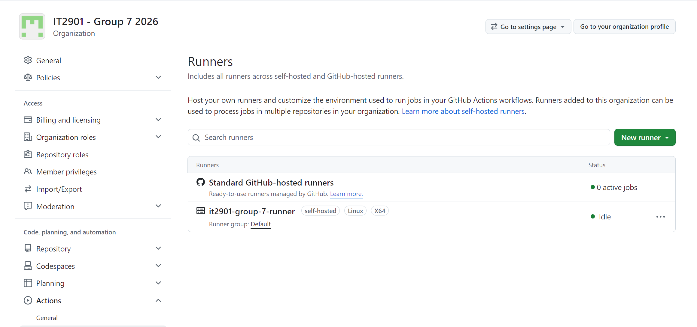

# Production server

You need to create and host a VM on some cloud provider. We use NTNUs StackIT (OpenStack). This document assumes you have already deployed the VM and picks up after you have SSHed into it.

<sub>NOTE: This assumes a standard Ubuntu server. It should still be easy to follow for other distros, but not Windows server.</sub>

This document explains both *hosting the application* and *hosting the GitHub Actions runner* (for deployment from GitHub).

## Hosting the application

### Installation

```bash
# (SSH-ed into your server)

# Update the package list
sudo apt-get update

# Install Docker, Docker Compose, Git and .NET SDK
sudo apt-get install -y docker.io docker-compose-v2 git dotnet-sdk-10.0
# If `dotnet-sdk-10.0` cannot be found, install the Microsoft package repository for your Ubuntu version first.

# Add your user to the docker group so you don't need 'sudo' for docker commands
sudo usermod -aG docker $USER

# Log out and log back in for group changes to take effect
exit

# ----
# SSH back into your server and run:

cd ~/

git clone https://github.com/tdt4290-group2/healthtech.git

cd ~/healthtech
```

### Environment variables

Environment variables are handled differently in production, because we need them for both the application and the GitHub Actions runner. We store them in a separate directory because the GitHub Actions runner needs to copy them for running [the deployment workflow](./.github/workflows/deploy.yml). This is not strictly necessary, but it is a good practice to keep the environment variables separate from the code since they are used by two applications.

```bash
# (SSH-ed into your server)

# Create the directory
mkdir -p ~/env

# Copy the .env.example files into the new directory
cp ~/healthtech/frontend/.env.example ~/env/frontend.env
cp ~/healthtech/backend/.env.example ~/env/backend.env

# Set the correct permissions
chmod 600 ~/env/frontend.env ~/env/backend.env

# Update your secrets
nano ~/env/frontend.env
nano ~/env/backend.env
# You use CTRL+O to save and CTRL+X to exit in nano.
```

### Run database migrations

The migrator service in our `docker-compose.prd.yml` is set up to run the migrations automatically when you launch the app, but you can also run them manually if you want more control or need to troubleshoot.

```bash
# IMPORTANT: Read the text above
# (SSH-ed into your server)

cd ~/healthtech

docker compose --env-file ~/env/backend.env -f docker-compose.prd.yml run --rm migrator
```

### Launch the application

Build and start all services (database, backend, frontend, and Traefik) from the root directory:

```bash
# (SSH-ed into your server)

cd ~/healthtech

docker compose --env-file ~/env/backend.env -f docker-compose.prd.yml up --build -d
# NOTE: Seed the database after the containers are running. See the section below.

# To stop the app:
#   docker compose --env-file ~/env/backend.env -f docker-compose.prd.yml down
# If you also want to remove volumes (the database's data):
#   docker compose --env-file ~/env/backend.env -f docker-compose.prd.yml down -v

# If you run into caching issues, you can try building first, then running:
#   docker compose --env-file ~/env/backend.env -f docker-compose.prd.yml build --no-cache
#   docker compose --env-file ~/env/backend.env -f docker-compose.prd.yml up -d
```

Note that our Traefik configuration is made for using an IP address instead of a domain. If you want to use a domain, you need to update the `Host` rules in `infra/traefik/traefik.yml` and ensure your DNS points to your server.

**Your app is now accessible at `http://<your-server-ip>`** as long as the containers are running and your cloud firewall/security group allows inbound HTTP traffic on port 80.

### Seed the database

#### Copying the CSV files

Use a program like WinSCP/Cyberduck/FileZilla to upload the files, or use rsync **from your local machine** (NOT when SSH-ed into the server):

```sh
# IMPORTANT: Run the following commands on your local machine, NOT on the server.

# Navigate to backend/seed directory on your local machine
cd path/to/healthtech/backend/seed

rsync -avP -e "ssh -i ./your-key.pem" *.csv ubuntu@<HOST_IP_ADDRESS>:~/healthtech/backend/seed/
# Update these fields   ^^^^^^^^^^^^               ^^^^^^^^^^^^^^^^^

# If you use an SSH key manager like 1Password, simply omit the -i flag:
# rsync -avP -e "ssh" *.csv ubuntu@<HOST_IP_ADDRESS>:~/healthtech/backend/seed/

# If you are on WSL, you might need to copy the .pem to WSL and use that file instead, since WSL sometimes messes with file permissions.
# From WSL, NOT SSH-ed into the server:
#   cd ~/healthtech
#   mkdir -p ~/.ssh
#   cp /mnt/c/Users/.../my-key.pem ~/.ssh/
#   chmod 400 ~/.ssh/my-key.pem
# Then use:
# rsync -avP -e "ssh -i ~/.ssh/my-key.pem" *.csv ubuntu@<HOST_IP_ADDRESS>:~/healthtech/backend/seed/
```

#### Seeding the database

You need to have copied the CSV files ([Copying the CSV files](#copying-the-csv-files)) to the server and built the Docker images ([Launch the application](#launch-the-application)) before you can seed the database.

```bash
# (SSH-ed into your server)

cd ~/healthtech

docker exec -it healthtech-prd-db-1 psql -U postgres -d healthtech -f /seed/seed.sql
```

### Maintenance and logs

Check if everything is running correctly:

```bash
# (SSH-ed into your server)

cd ~/healthtech

# See status of all production containers
docker compose --env-file ~/env/backend.env -f docker-compose.prd.yml ps
# To see ALL containers: docker ps

# Follow logs for a specific container (you can find names from the previous command)
docker compose --env-file ~/env/backend.env -f docker-compose.prd.yml logs -f backend
docker compose --env-file ~/env/backend.env -f docker-compose.prd.yml logs -f frontend
docker compose --env-file ~/env/backend.env -f docker-compose.prd.yml logs -f db
docker compose --env-file ~/env/backend.env -f docker-compose.prd.yml logs -f traefik
```

## Setting up the GitHub Actions runner

IMPORTANT: Set up this runner in the VM.

Our CI/CD pipeline is set up to run lint/test on GitHub's hosted runners, and the deployment on our own self-hosted runner. This is to avoid having to SSH into the server, where we had trouble with NTNU blocking requests to port 22 from GitHub's hosted runners.

You need to set up the runner like GitHub describes in GitHub's "Runners" page (your repository > Actions > Runners > New runner > New runner > New self-hosted runner).

Notes:
- We chose Linux and x64.
- We made sure the runner exists at `~/actions-runner/` by doing `mkdir ~/actions-runner && cd ~/actions-runner`.



After setting the local GitHub Actions runner and confirming that `./run.sh` works, install the runner as a service (so it starts on boot):

```bash
cd ~/actions-runner

sudo ./svc.sh install
```

Then, use the following commands as needed:

```bash
cd ~/actions-runner

sudo ./svc.sh status
sudo ./svc.sh start
sudo ./svc.sh stop
sudo ./svc.sh uninstall
```

See [`./.github/workflows/deploy.yml`](./.github/workflows/deploy.yml) for the deployment workflow.
