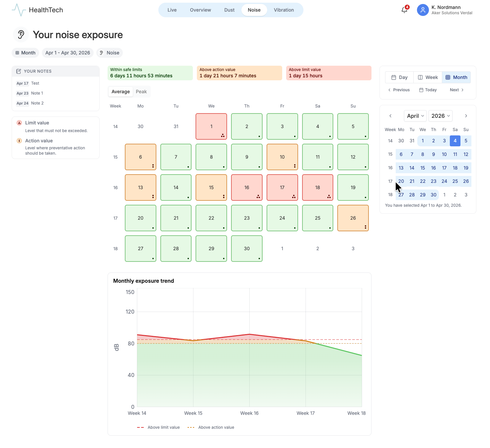
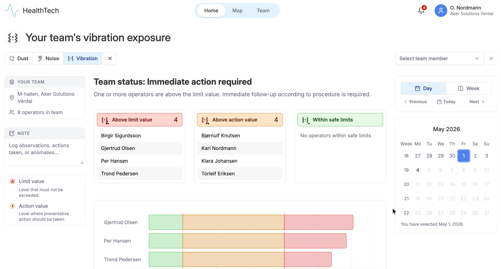
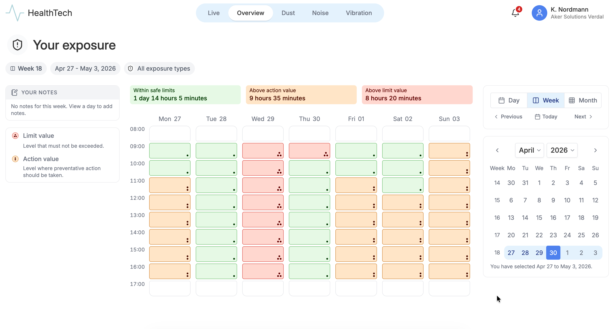
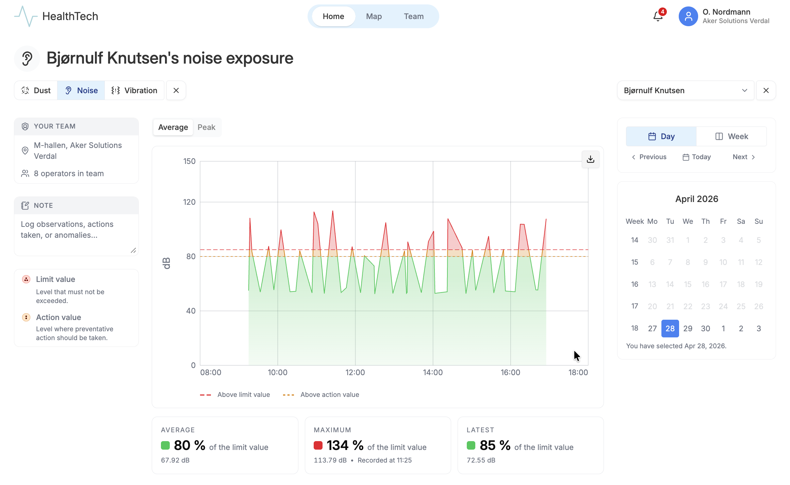
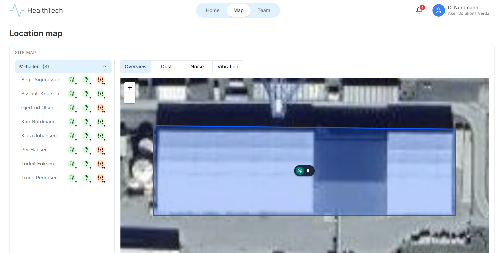

# HealthTech

HealthTech is a Bachelor's thesis project for Aker Solutions. This is the second group of students to work on the project.

<table>
  <tr>
    <td rowspan="2" align="center" width="50%">
      
      <br />
      <sub>A month of an operator's noise data</sub>
    </td>
    <td align="center" width="50%">
      
      <br />
      <sub>A foreman's vibration data for their team</sub>
    </td>
  </tr>
  <tr>
    <td align="center" width="50%">
      
      <br />
      <sub>An operator's weekly overview</sub>
    </td>
  </tr>
  <tr>
    <td align="center" width="50%">
      
      <br />
      <sub>A foreman viewing noise data for an operator</sub>
    </td>
    <td align="center" width="50%">
      
      <br />
      <sub>A foreman's overview of the map</sub>
    </td>
  </tr>
</table>

## Requirements

- [Docker](https://www.docker.com/get-started)
- [.NET SDK 10](https://dotnet.microsoft.com/en-us/download/dotnet/10.0)
- [Node](https://nodejs.org/en)
- [pnpm](https://pnpm.io/)

## Documentation

See [PRODUCTION.md](./PRODUCTION.md) for instructions about how to deploy to production.

---

## Getting started with local development

### Set up environment variables

Copy the `.env.example` files into `.env` files in both `./backend/` and `./frontend/` from project root.

```sh	
# From project root
cp ./backend/.env.example ./backend/.env
cp ./frontend/.env.example ./frontend/.env
```

Remember to change the default database password (`your_secure_password`) in `POSTGRES_PASSWORD` and `DATABASE_URL`.

### Set up the backend

1. Download the CSV-files from [https://drive.google.com/drive/folders/13XkM6DRK6iyz9pC4Akvj1-1KjRx4wFkc?usp=drive_link](https://drive.google.com/drive/folders/13XkM6DRK6iyz9pC4Akvj1-1KjRx4wFkc?usp=drive_link).
2. Copy them into `./backend/seed/`.

You may also have to download `ef`, which you can do by running: `dotnet tool install --global dotnet-ef`

Then run the following commands in the root directory of the project:

```sh
# From project root

# Start the database
docker compose --env-file ./backend/.env up -d db

# Navigate to the backend directory
cd backend

# Run migrations
dotnet ef database update --project src

# Navigate back to the root directory
cd ..

# Seed the database with sample data. This may take a few minutes.
docker exec -it healthtech-dev-db-1 psql -U postgres -d healthtech -f /seed/seed.sql
```

### Start the backend

```sh
# From project root
cd backend

# Start the backend:
dotnet watch run --project src
# If you have the C# VS Code extension installed, you can also start the backend with F5.

# The backend will be running at http://localhost:5063
```

### Run the frontend

In a new terminal, run the following commands:

```sh
# Navigate to the frontend directory
cd frontend

# Install dependencies
pnpm install

# Start the frontend
pnpm run dev

# The frontend will be running at http://localhost:5173
```

## Run tests

```sh
# Navigate to the backend directory
cd backend

# Run tests
dotnet test
```

## Linting and formatting

In the backend directory, you can run the following commands:

```sh
# Navigate to the backend directory
cd backend

# Format the backend code
dotnet csharpier format .

# Check for linting errors
dotnet csharpier check .
```

In the frontend directory, you can run the following commands:

```sh
# Navigate to the frontend directory
cd frontend

# Lint and format
pnpm run check:fix

# Or separately:

# Check for linting errors and apply safe fixes
# pnpm run lint:fix

# Check for formatting errors and apply safe fixes
# pnpm run format:fix

# Omitting the `:fix` will only check for errors and not apply any fixes.
```
